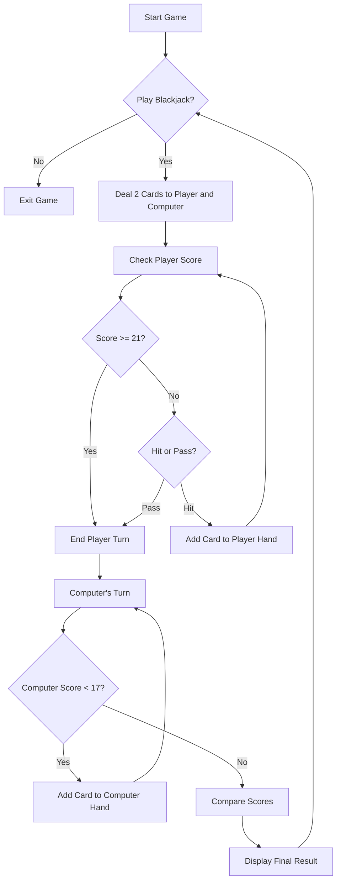

# 🃏 Blackjack Game (Python) 🎰

Welcome to the **Blackjack** card game built with Python! This is a simple command-line version of the classic casino game where you play against the computer. Try to beat the dealer without going over 21! 🧠💥

---

## 🎮 How to Play

- At the start of the game, you and the computer each get **two cards**.
- The goal is to have a hand value as **close to 21** as possible **without going over**.
- You can choose to **draw another card** (`hit`) or **pass** (`stand`).
- If your hand goes over 21, you **bust** and lose.
- The computer (dealer) must keep drawing cards until their total is **17 or higher**.
- Aces can be worth **11 or 1**, automatically adjusted if it helps your hand stay under 21.

---

## 🧾 Rules

- All face cards (Jack, Queen, King) are worth `10`.
- Aces start as `11` but can turn into `1` if you go over 21.
- The computer (dealer) always reveals one card and plays after the player finishes.
- The game compares scores to determine the winner.

---

## 📦 Features

✅ Random card drawing  
✅ Ace adjustment (11 → 1 if needed)  
✅ Computer dealer logic (hits until 17)  
✅ Player-controlled turns  
✅ Score comparison and result messages  
✅ Game restarts automatically if the user wants to play again  
✅ Clear console and ASCII art logo (via `art` module)

---
## 🔄 Game Flowchart

## 💡 Future Ideas

- Add betting and virtual currency 💰
- Track score across multiple rounds 📊
- Multiplayer support 🎮
- More realistic deck with limited cards 🃏
