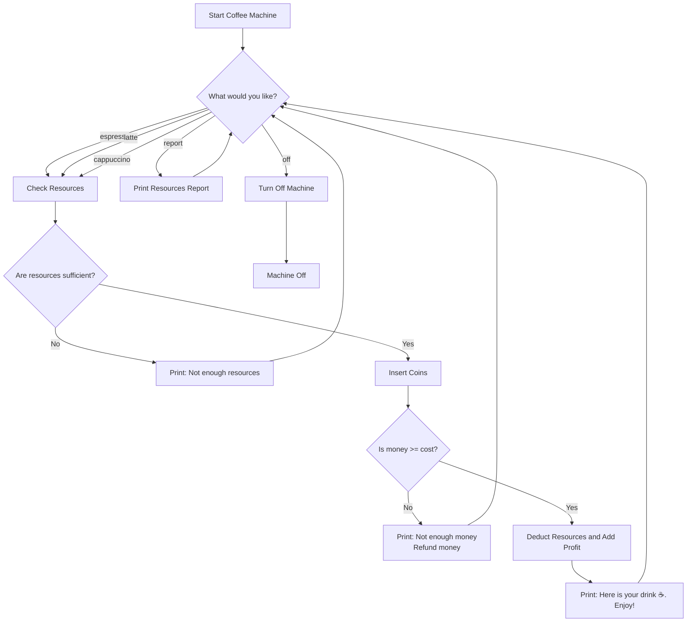

# ☕ Coffee Machine Project

A simple text-based coffee machine simulator written in Python. This project allows a user to choose a drink (espresso, latte, or cappuccino), insert coins, and receive the drink if there are enough resources and payment is sufficient.

---

## 📋 Features

- Simulates a coffee machine with limited resources.
- Supports commands like `report` to view resources and `off` to stop the machine.
- Handles coin inputs and calculates change.
- Validates resource availability before processing transactions.

---

## 🛠️ How to Use

1. Run the Python script.
2. Choose a drink: `espresso`, `latte`, or `cappuccino`.
3. Insert coins when prompted.
4. If enough money and resources are available, your drink will be served.

Special commands:
- Type `report` to see remaining resources.
- Type `off` to shut down the machine.

---

## 💡 Example

```text
What would you like? (espresso/latte/cappuccino): latte
Please insert coins.
How many quarters?: 10
How many dimes?: 0
How many nickles?: 0
How many pennies?: 0
Here is $0.0 in change.
Here is your latte ☕️. Enjoy!
```

## 🔄 Game Flowchart



🚀 Future Improvements
- GUI version using Tkinter or PyQt.
- Object-oriented refactor.
- Persistent resource saving across sessions.
